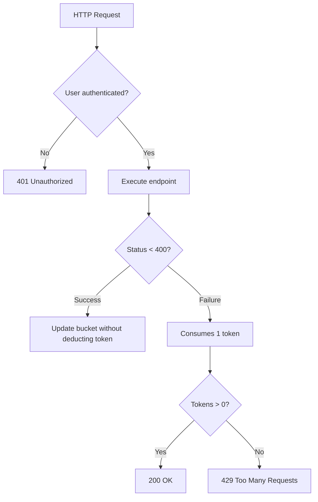

# Leaky Bucket

## 🚀 Getting Started

These instructions will get you a copy of the project up and running on your local machine for development and testing purposes.

See **[Deployment](#-deployment)** for notes on how to deploy the project on a live system.

### 📋 Prerequisites

Make sure you have the following tools installed on your machine:

- [Docker](https://www.docker.com/)
- [Docker Compose](https://docs.docker.com/compose/)
- [Node.js](https://nodejs.org/) (for local development if needed)

### 🔧 Installation

Step-by-step instructions to get your development environment running:

```bash
# Clone the repository
git clone https://github.com/yourusername/leaky-bucket.git

# Navigate to the project directory
cd leaky-bucket

# Start the application using Docker Compose (database)
docker-compose up -d

# Run the development server
npm run dev
```

Once everything is running, the server should be available at:

```
 http://localhost:3000
```

And Graphql server 

```
GraphQL server ready at http://localhost:3000/graphql
```


## 📦 Deployment

To deploy this project on a live system:

1. Make sure Docker and Docker Compose are installed.
2. Pull the latest version of the project.
3. Run `docker-compose up -d` to start the services.
4. Configure environment variables if needed.

## 🛠️ Built With

- [Node.js](https://nodejs.org/)
- [Express](https://expressjs.com/)
- [Docker](https://www.docker.com/)
- [Koa](https://koajs.com/)
- [Zod](https://koajs.com/)
- [GraphQL](https://graphql.org/)
- [TypeScript](https://www.typescriptlang.org/) *(if applicable)*


### Routes of the application:

- **Authentication Routes**: Details the routes for user login and authentication.
- **User Routes**: Includes routes for creating, retrieving, and manipulating users.
- **Pix key routes**: Example of how to document routes for manipulating products.

# API Routes

## Authentication

- `POST /api/v1/authentication` - Authenticate a user and return a JWT token.

## Users

- `POST /api/v1/users` - Create a new user.

## Pix key

- `GET /api/v1/pix/query/{key}` - Get a pix key by key.
- `POST /api/v1/pix/query` - Create a new pix key.
- `GET /api/v1/pix/query?userId={userId}` - Get a list of pix keys by user ID.
- `DELETE /api/v1/pix/query/{key}` - Delete a pix key by key.

## Leaky bucket implementation

# Documentação do Sistema de Rate Limiting - Leaky Bucket



This System that controls the frequency of requests using the Leaky Bucket pattern:

Objective 
- Prevent API abuse
- Mechanism: Tokens are gradually replenished (1 per hour)

Behavior
- Successes: Do not consume tokens
- Failures: Tokens consume 1

## ✒️ Authors

- **Hebert santos** – *Initial work* – [@hebertzin](https://github.com/hebertzin)

## 📄 License

This project is licensed under the MIT License - see the [LICENSE.md](https://github.com/yourusername/leaky-bucket/blob/main/LICENSE) file for details.
