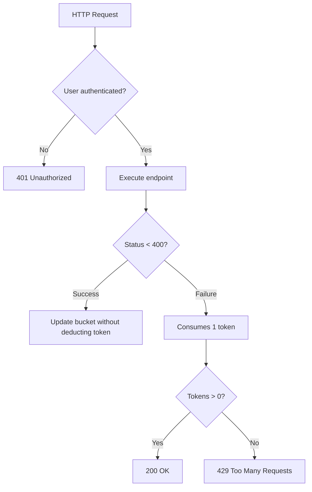

# Leaky Bucket


## Getting Started

This project provides a rate-limiting system based on the **Leaky Bucket** algorithm to control the frequency of requests, helping prevent API abuse. The following instructions will guide you on setting up the project locally for development and testing.

---

### Prerequisites

Make sure the following tools are installed on your machine:

- [Docker](https://www.docker.com/)
- [Docker Compose](https://docs.docker.com/compose/)
- [Node.js](https://nodejs.org/) (for local development, if needed)

---

### Installation

Follow these steps to get your development environment up and running:

```bash
# Clone the repository
git clone https://github.com/yourusername/leaky-bucket.git

# Navigate into the project directory
cd leaky-bucket

# Start the application services using Docker Compose (includes database setup)
docker-compose up -d

# Run the development server
npm run dev
```

Once everything is set up, the application will be available at:

- **Application Server**: [http://localhost:3000](http://localhost:3000)
- **GraphQL Server**: [http://localhost:3000/graphql](http://localhost:3000/graphql)

---

## Deployment

To deploy this project on a live system, follow these steps:

1. Ensure Docker and Docker Compose are installed on your server.
2. Pull the latest version of the project.
3. Run `docker-compose up -d` to start all services.
4. Configure any environment variables if needed.
5. The application will now be accessible via your domain.
6. 
---

## Built With

This project utilizes the following technologies:

- [Node.js](https://nodejs.org/)
- [Husky](https://nodejs.org/)
- [Docker](https://www.docker.com/)
- [Koa](https://koajs.com/)
- [Zod](https://zod.dev/)
- [GraphQL](https://graphql.org/)
- [TypeScript](https://www.typescriptlang.org/)

---

## API Routes

### Authentication

- `POST /api/v1/authentication`
  - **Description**: Authenticate a user and return a JWT token.
  - **Request Example**:
    ```json
    {
      "email": "user@example.com",
      "password": "password123"
    }
    ```
  - **Response**:
    ```json
    {
      "code": 200,
      "message": "Authentication successful",
      "token": "jwt_token"
    }
    ```

---

### Users

- `POST /api/v1/users`
  - **Description**: Create a new user.
  - **Request Example**:
    ```json
    {
      "name": "Hebert Santos",
      "email": "hebertsantosdeveloper@gmail.com",
      "password": "20304050"
    }
    ```
  - **Response**:
    ```json
    {
      "code": 201,
      "message": "User created successfully",
      "data": {
        "id": "user_id",
        "name": "Hebert Santos",
        "email": "hebertsantosdeveloper@gmail.com"
      }
    }
    ```

---

### Pix Key

- `GET /api/v1/pix/query/{key}`
  - **Description**: Retrieve a Pix key by its value.
  - **Response**:
    ```json
    {
      "code": 200,
      "message": "Pix key retrieved successfully",
      "data": {
        "key": "hebertzinmariana0704@gmail.com",
        "type": "EMAIL",
        "bank": "Inter"
      }
    }
    ```

- `POST /api/v1/pix/query`
  - **Description**: Create a new Pix key.
  - **Request Example**:
    ```json
    {
      "key": "hebertzinmariana0704@gmail.com",
      "type": "EMAIL",
      "bank": "Inter"
    }
    ```
  - **Response**:
    ```json
    {
      "code": 201,
      "message": "Pix key created successfully",
      "data": {
        "type": "EMAIL",
        "key": "hebertzinmariana0704@gmail.com"
      }
    }
    ```
  > The `userId` and `owner` fields are automatically populated based on the authenticated user.

- `GET /api/v1/pix/query/all`
  - **Description**: Retrieve a list of Pix keys associated with the authenticated user.
  - **Response**:
    ```json
    {
      "code": 200,
      "message": "Pix keys retrieved successfully",
      "data": [
        {
          "key": "hebertzinmariana0704@gmail.com",
          "type": "EMAIL",
          "bank": "Inter"
        }
      ]
    }
    ```

- `DELETE /api/v1/pix/query/{key}`
  - **Description**: Delete a Pix key by its value.
  - **Response**:
    ```json
    {
      "code": 200,
      "message": "Pix key deleted successfully"
    }
    ```

---

## Leaky Bucket Rate Limiting

The **Leaky Bucket** algorithm is used to manage request frequency. It allows requests at a constant rate, while excess requests overflow. The algorithm operates as follows:

1. **If the request is successful**, it does not consume any tokens.
2. **If the request fails**, it consumes 1 token from the bucket.
3. **Tokens** are replenished gradually (1 token per hour).

### Behavior

- **Success Requests**: No tokens consumed.
- **Failure Requests**: 1 token is consumed for each failed request.

### Leaky Bucket Flow (Diagram)



---

## Authors

- **Hebert Santos** – *Initial work* – [@hebertzin](https://github.com/hebertzin)

---

## License

This project is licensed under the **MIT License**. See the [LICENSE.md](https://github.com/yourusername/leaky-bucket/blob/main/LICENSE) file for more details.
