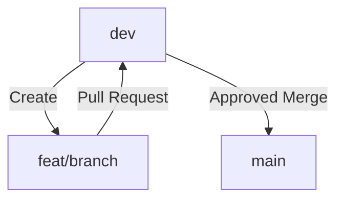

# Git Workflow

## 📋 Branch Rules

- Always create **new branches** from the `dev` branch.
- Branches should follow this naming convention:
  - For **new features**: `feat/feature-name`
  - For **bug fixes**: `fix/bug-description`
  - For **improvements or chores**: `chore/task-description`

## 🔀 Development Process

1. **Checkout to `dev`**:
   ```bash
   git switch dev
   git pull origin dev
   ```

2. **Create a new branch** from `dev`:
   ```bash
   git checkout -b feat/feature-name
   ```
   or, for fixes:
   ```bash
   git checkout -b fix/bug-description
   ```

3. **Develop your feature or fix**.

4. **Commit and push your changes**:
   ```bash
   git add .
   git commit -m "feat: short description of the feature"
   git push origin feat/feature-name
   ```

5. **Open a Pull Request (PR)** from your branch to `dev`.
   - Ensure all tests are passing.
   - Request a code review if needed.

6. **After approval**, the branch will be merged into `dev`.

7. **Deploy to production**:
   - When a release is needed, `dev` will be manually merged into `main`.
   - After merging, a release tag should be created on `main` (optional).

## 🗂️ Visual Flow

